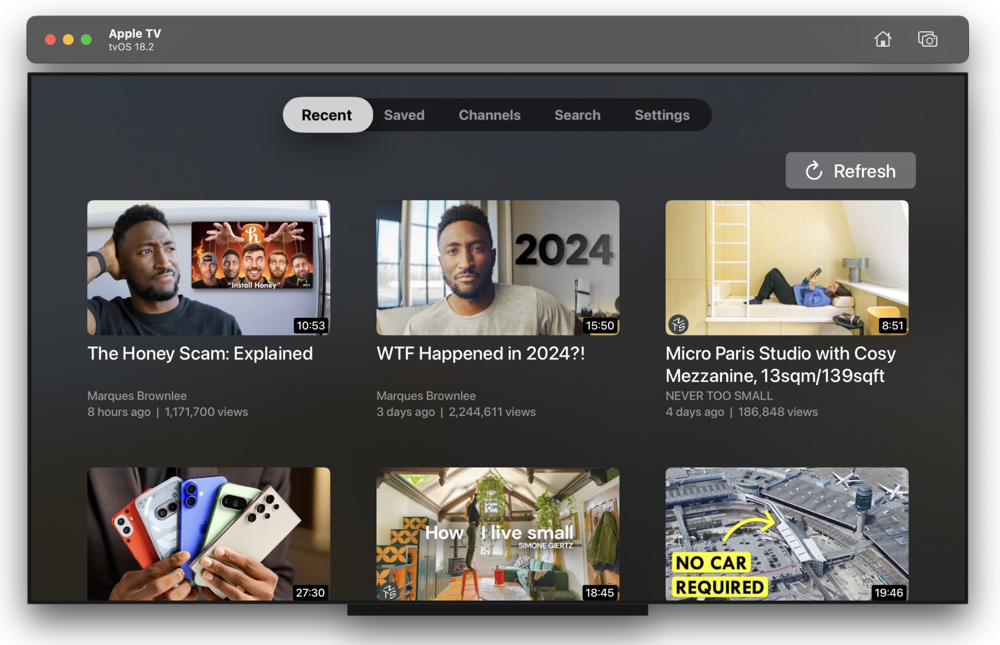

# ClearTube

[Watch demo video](https://www.youtube.com/watch?v=BLldvm0WObA)

ClearTube is a cross-platform video streaming app built for **iOS**, **macOS**, and **tvOS**, designed to search, browse, and play YouTube videos. I never used Swift before starting this project, so I used AI (specifically ChatGPT) heavily to help write the majority of the code (as well as the majority of this readme, based on this [prompt](https://chatgpt.com/share/6774cabd-cd9c-8013-ac32-c14dc273ef8a))

## 📱 **Platforms Supported**

- iOS (iPhone & iPad)
- macOS
- tvOS (Apple TV)

## 🚀 **Features**

- **YouTube Video Playback:** Search and play YouTube videos seamlessly.
- **Invidious API Integration:** Primary backend for video search and playback.
- **InnerTube API Fallback:** Custom implementation of Google's InnerTube API for reliability.
- **Cross-Platform Design:** Tailored user experiences for mobile, desktop, and TV environments.
- **SwiftUI-Driven UI:** Unified UI framework across all platforms.

## 🛠️ **Technical Details**

- Built with **Swift** and **SwiftUI**.
- Custom API implementation for **Invidious** and **InnerTube**.
- Inspired by and initially based on [magnetardev/tube](https://github.com/magnetardev/tube), later rewritten entirely for cross-platform compatibility.

## 💡 **Learning Experience**

- **First iOS/tvOS Project:** ClearTube marks my first attempt at developing iOS and tvOS applications.
- **ChatGPT Collaboration:** Leveraged ChatGPT extensively to understand SwiftUI patterns, fix bugs, and optimize the architecture.
- **Iterative Refactoring:** Started from an existing codebase but progressively rewrote and improved it for scalability and maintainability.

## 📂 **Project Structure Overview**

- **APIs:** Handles network requests for Invidious, InnerTube, and SponsorBlock.
- **Model:** Defines data structures for video, search, and playback responses.
- **Views:** SwiftUI views tailored for iOS and tvOS platforms.
- **Shared Components:** Reusable UI and logic components across platforms.

## 🤖 **Technologies Used**

- Swift / SwiftUI
- Invidious API
- InnerTube API
- SponsorBlock API

## 📝 **Acknowledgements**

- The initial codebase was based on [magnetardev/tube](https://github.com/magnetardev/tube)
- The Swift InnerTube implementation was written from scratch, with inspiration from [tombulled/innertube](https://github.com/tombulled/innertube) and [LuanRT/YouTube.js](https://github.com/LuanRT/YouTube.js)
- ChatGPT for continuous development support.

## 🛡️ **Disclaimer**

This project is built for educational purposes and is not affiliated with or endorsed by YouTube or Google.

---

Thank you for exploring ClearTube! 🚀

_Built with passion, curiosity, and lots of Swift._
